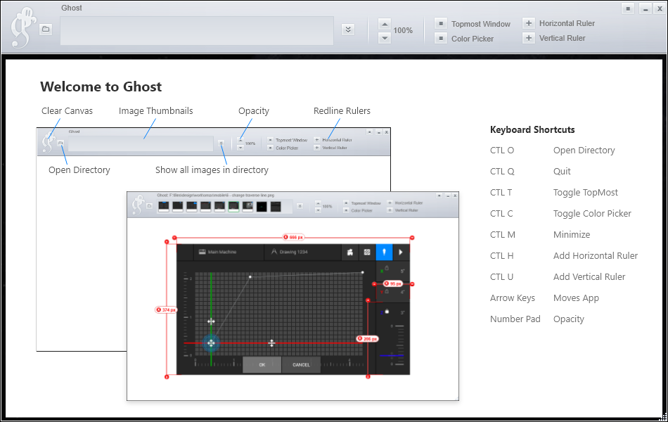

# Ghost
A simple WPF app that allows you to preview designs over top your build output. It also allows you to measure sizes and space. I built in 2010 for developers to eliminate the dependency on getting redlines from designers.  

### About
I Created this in 2009 but I may do another version that is more up to date, if time permits.

- VisualStudio
- .Net 3.5
- WPF
